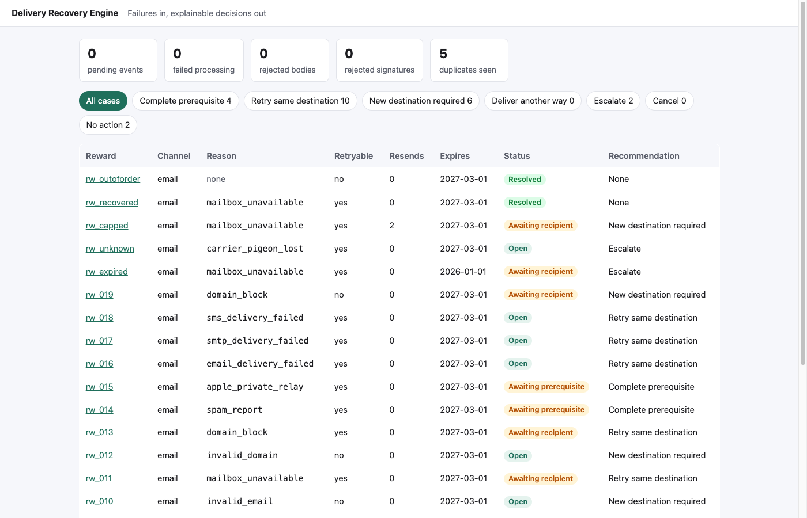
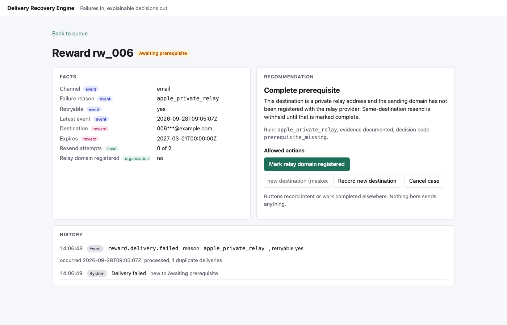
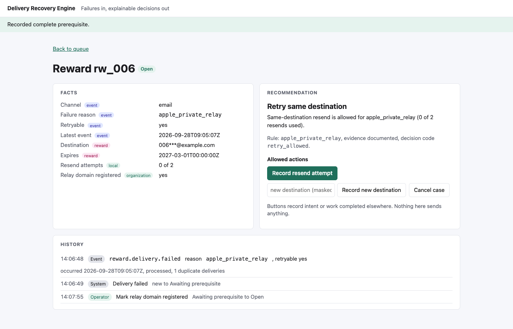
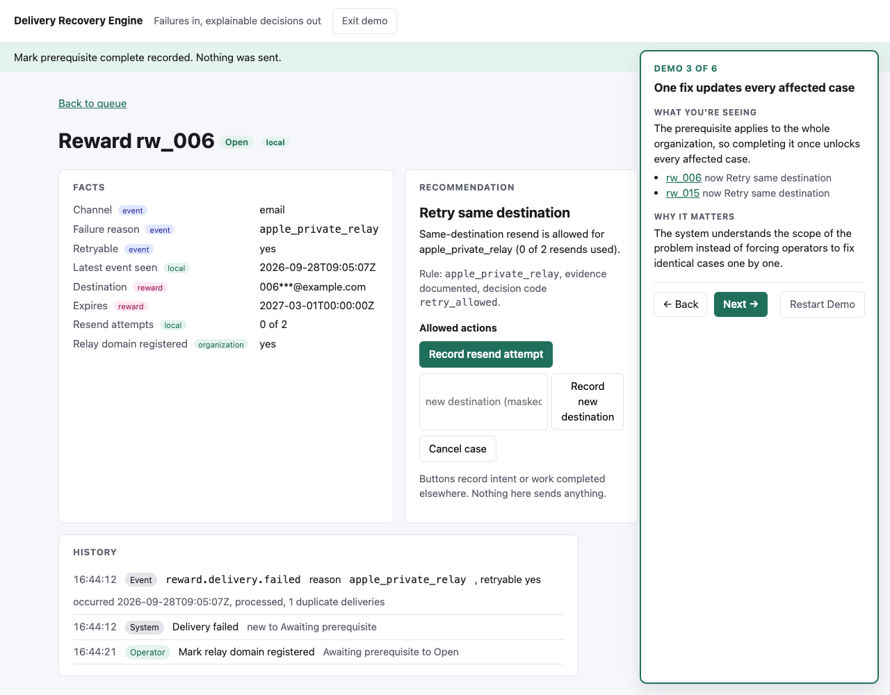

# Delivery Recovery Engine

Delivery Recovery Engine explores how to turn an at-least-once stream of delivery failures into safe, explainable operational decisions. Webhooks may be retried, events may arrive later than expected, and operators may race with one another. The system therefore treats transport delivery, durable ingestion, domain decisions and audit history as separate concerns.

It is a small Rails 8 application, built in a day, for the case where a reward or payout notification could not be delivered to its recipient and someone has to decide what to do next.

[](https://github.com/mateusgetulio/delivery-recovery-engine/actions/workflows/ci.yml)

## The six guarantees

1. Duplicate webhook delivery cannot duplicate the business effect. The inbox has a unique index on the event uuid, and each event can produce at most one transition.
2. Invalid signatures never reach domain processing. The signature is checked over the raw body before anything is parsed or stored.
3. Recovery actions are derived from explicit facts by one pure policy, driven by a rules table with an evidence column.
4. The resend cap cannot be exceeded, including under concurrent operator requests. Every operator action carries the case version it was decided on.
5. Older events cannot silently regress newer case state. A success followed by a stale failure stays resolved; the stale event is recorded as ignored.
6. Every committed business transition has exactly one append-only audit record, written in the same database transaction as the change. The model refuses any other write path.

## Demo









### Guided demo

Start it from the "Start Guided Demo" link in the header (or `/demo`). Starting resets the data to a known state and walks six steps inside the real application, each with a panel that says what is on the screen, why it matters, and which button to press. The buttons are the application's own actions; the only demo-specific code resets, navigates, explains and prepares state. Every restart produces exactly the same cases, recommendations, counts, history and button states, so it can be recorded repeatedly without touching the terminal.

1. New failures arrive: an empty queue, then "Simulate incoming delivery events" replays the fixture through the webhook path. 26 events accepted, 5 duplicates ignored.
2. The system blocks an unsafe retry: the private relay case, recommendation "Complete prerequisite", retry unavailable. Press "Mark relay domain registered".
3. One fix updates every affected case: the same case now says "Retry same destination", and the panel lists the other relay case that changed with it.
4. The system knows when to stop retrying: a case prepared with one resend already recorded. Press "Record resend attempt" and the button disappears, with the explanation that the prototype's configured retry limit has been reached.
5. Unknown problems fail safe: the unknown-reason case, raw code shown, recommendation "Escalate".
6. Old information cannot undo newer truth: the out-of-order case, resolved, with the older failure in the history as ignored and stale. "Finish Demo" ends on a four-point summary.

The terminal script, for the same beats plus the signature check:

1. Start from an empty queue. Run `bin/rails demo:replay`. The header shows 26 accepted, 5 duplicates, 0 rejected. Every event went through signature verification, the inbox and the processing job; nothing bypassed the real path.
2. Open the relay case. The facts carry their owner (event, reward, local, organization). The recommendation is "Complete prerequisite" with the rule that produced it, and there is no resend button. Click "Mark relay domain registered". The recommendation flips to "Retry same destination", and so does every other relay case, because the fact is organization scoped.
3. Click "Record resend attempt" twice. The second time the button is gone and the explanation says the cap is reached. Open the same case in a second tab beforehand and press the button there: the case changed since it was shown, nothing applied.
4. Open the expired case: only escalate and cancel. Open the unknown-reason case: escalate, with the raw code shown.
5. Open the case whose failure arrived after its success: resolved, and the history shows the failure as ignored, stale.
6. Run `bin/rails demo:replay` again. Nothing changes except the duplicate counter. Run `TAMPER=1 bin/rails demo:replay`: one rejected signature, nothing else moved.

## How it works

### Facts have three owners

```
EventFacts      from the webhook          reason, retryable, channel, occurred_at
RewardFacts     from a reward lookup      expires_at, destination (a fixture here)
LocalState      owned by this system      status, resend_count, prerequisites, latest_event_at
```

An event can replace event facts. It can never write local state, so a replayed or forged event cannot reset a resend count or complete a prerequisite. The detail page labels every fact with its owner.

### The rules table

`config/recovery_rules.yml` holds one row per failure reason: whether the same destination may be retried, which prerequisite must be complete first, the other documented routes, and an `evidence` column (`documented`, `assumed` or `prototype`) so the README and the code never claim more than the source material supports. The unknown-reason row escalates and keeps the raw code.

Overrides apply after the row, in order: not retryable, resend cap reached, prerequisite incomplete, reward expired, case settled. The recommendation is the first allowed action in a fixed priority; the detail page shows all allowed actions.

Two prerequisites exist, deliberately without a framework: relay registration, which is organization scoped and completes every waiting relay case at once, and spam suppression removal, which is case scoped.

### The state machine

Six states: `open`, `awaiting_prerequisite`, `awaiting_recipient`, `resolved`, `escalated`, `cancelled`. A failure opens or reopens a case; a success resolves it; an event older than the case's latest event is ignored as stale; escalated and cancelled cases ignore everything. Ties on `occurred_at` are broken by inbox insertion order, which is a simplification the README owns rather than a claim about any provider's ordering.

### Ingestion

`POST /webhooks/delivery` verifies `X-Webhook-Signature` (HMAC-SHA256 hex over the raw body) with a constant-time compare. An invalid signature is a 401 that stores nothing and is counted. Every signed request answers 200 with a status body, because retrying a malformed or duplicate body cannot help: `accepted`, `duplicate`, `ignored` (unknown event type, or a known type missing a payload field; stored in the inbox with the reason so its uuid still dedupes) or `rejected` (no uuid at all, stored in `rejected_requests` so it stays visible).

Accepted events are durable in `inbound_events` before any processing. The job is enqueued after the transaction commits (`enqueue_after_transaction_commit` is on) as an optimization; `bin/rails inbox:process_pending` and a recurring Solid Queue entry pick up anything left pending. There is no custom claim mechanism: the job runner claims, and the apply is idempotent.

### The apply transaction

One transaction locks the inbound event, returns early if a transition already exists for it, computes the effect with the pure `Recovery::Apply`, writes the case, the transition and the inbox status flip, and commits. A worker that dies before commit leaves nothing; one that dies after commit finds the transition on retry and stops. A concurrent operator action raises a stale-object error, and two workers racing to create the same case hit the unique index; both make the job retry rather than parking the event as failed.

### Operator actions

Buttons record intent or work completed elsewhere; nothing sends anything, and the labels say so ("Record resend attempt", "Mark relay domain registered"). Every action goes through `Recovery::Act`, which checks the case version from the form, asks the policy whether the action is allowed, applies it and writes one transition, all in one transaction. Refusals are explicit errors: `ResendLimitReached`, `RewardExpired`, `PrerequisiteMissing`, `ActionNotAllowed`, `StaleCaseVersion`. Recording a new destination does not overwrite the reward-owned destination; the value lives in the transition and is shown as a local fact.

## Invariants

| Id | Statement | Test |
|---|---|---|
| INV-1 | The policy reads only the injected clock | `test/lib/recovery/policy_test.rb` |
| INV-2 | Not retryable never allows a same-destination resend | `test/lib/recovery/policy_test.rb` (unit and generated) |
| INV-3 | The resend cap withholds resend at the cap and allows it below | `test/lib/recovery/policy_test.rb`, `test/lib/recovery/act_test.rb` |
| INV-4 | Both prerequisites gate the resend, at their own scope | `test/lib/recovery/policy_test.rb`, `test/lib/recovery/act_test.rb` |
| INV-5 | Expiry is a boundary on the injected clock | `test/lib/recovery/policy_test.rb`, `test/lib/recovery/act_test.rb` |
| INV-6 | An unknown reason escalates and keeps the raw code | `test/lib/recovery/policy_test.rb`, `test/services/inbound_events/process_test.rb` |
| INV-7 | An invalid signature stores, enqueues and changes nothing | `test/controllers/webhooks/deliveries_controller_test.rb` |
| INV-8 | The same uuid twice, including two threads, yields one inbox row and one effect | `test/controllers/webhooks/deliveries_controller_test.rb`, `test/services/inbound_events/receive_concurrency_test.rb` |
| INV-9 | Re-running a processed event changes nothing; a crash before commit leaves nothing | `test/services/inbound_events/process_test.rb` |
| INV-10 | Success then stale failure stays resolved; newer failure reopens; equal timestamps apply | `test/lib/recovery/apply_test.rb`, `test/services/inbound_events/process_test.rb` |
| INV-11 | Two operators recording the final resend cannot exceed the cap | `test/lib/recovery/act_concurrency_test.rb` |
| INV-12 | Every committed change has one transition in the same transaction; no other write path exists | `test/models/delivery_case_test.rb`, `test/lib/recovery/act_test.rb` |

Generated policy tests use a seeded generator (`RECOVERY_TEST_SEED`) over reasons, retryable, resend counts, expiry and prerequisites; a failure prints the seed and the facts.

## Running it

Ruby 4.0 (pinned in `.ruby-version`), SQLite. No JavaScript.

```
bin/setup --skip-server        # bundle and database
bin/rails demo:replay          # signed fixture through the real webhook path, or use the guided demo in the browser
bin/rails server               # http://localhost:3000
bin/ci                         # bin/setup, RuboCop, bundler-audit, Brakeman, tests, seeds
```

`WEBHOOK_SECRET` signs and verifies; the replay task uses whatever the app is configured with, so the demo and production share one code path.

## What it does not do

- Nothing is sent. Resends, new destinations and other routes are recorded as intent for a person or another system to carry out.
- The resend cap of two is prototype policy. The material this was built from states a two-resend limit only for rewards that were delivered and not found, not for failures.
- Out-of-order handling is defensive integrator behavior, not a claim that any provider sends events out of order.
- The signature scheme is the common HMAC-SHA256 shape, not a compatibility claim for any provider's header or format.
- One organization, no authentication, no assignment, no bulk actions.
- SQLite serializes writers, so the two-thread tests assert on the unique index and the stale-version error rather than on true parallel interleaving. The row lock in the apply transaction is a no-op on SQLite and is there for a Postgres deployment.
- A newer success on an already resolved case is applied as resolved to resolved, advancing the latest event time, so later stale checks stay correct.
- Cancel is not offered on settled cases.
- The history shows events and transitions, not the recommendation that held after each step; that is derived at render time for the current state only.
- `WEBHOOK_SECRET` has a fallback only in development and test; production refuses to boot without it.
- Reward facts come from a fixture file that stands in for a reward lookup API.

## What I would measure in production

- Duplicate rate and stale-event rate per hour, to know how much of the transport's behavior the design actually absorbs.
- Time from failure to first operator action, by recommendation, to find the categories that stall.
- Resend success rate by reason, to learn which "retry same destination" rows are worth keeping.
- Cases reaching the cap, and what happened to them next.
